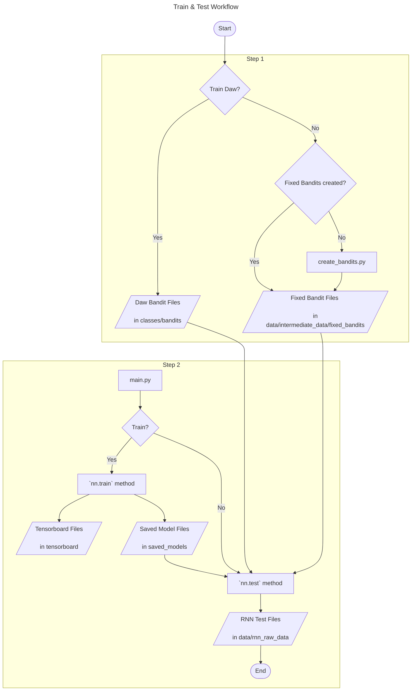

# Training and testing RNNs

```mermaid
---
title: Legend
---
flowchart LR

ID=([Start or End]) ~~~ ID1{Decision} ~~~ ID2[Process or Programm] ~~~ ID3[/ Input or Output /]
```




0.	Make sure that the current working directory is the projects root directory

Step 1: 
* Do you want to train on daw or fixed bandits (e.g., predefined bandits created by you)?
* If yes: Make sure, that daw bandit files are in classes/bandits (e.g., "Daw2006_payoffs1.csv")
* If no: You have to create bandits with scripts/create_bandits.py
   *  Run scripts/create_bandits.py in your IDE (e.g., Spyder) with global variables set accordingly
   *  This will save bandit tasks as zip files to data/intermediate_data/fixed_bandits
 
Step 2: 
* Open `main.py` and set the global variables accordingly
* Save the script and run `main.py` (In Spyder: You have to run the file via the green run button, running selected code via F9 does not work with multiprocessing)
   * The `nn.train` method is called in `main.py`, which saves training progress to the tensorboard and saved_models folder
   * After training is done, the `nn.test` method is called, which loads either daw or fixed bandits to test the RNN on them. Resulting test files are saved to data/rnn_raw_data (see ‘naming_conventions’ in the docs folder)
 
## Example

# Cognitive Modeling with human and RNN data
0.	Preprocessing
    * Human data: Run `scripts/preprocess_human_data.R` 
    * RNN data:
        * Open `scripts/modeling_call.R`
        * Run preprocess test files section in `modeling_call.R`
    * Files (.RData files) are saved under `path_to_save_formatted_data` (default: 'data/intermediate_data/modeling/preprocessed_data_for_modeling')
   
 1. Model fit
    *  Open `scripts/modeling_call.R`
    *  RNN data: Run Fit RNN data section in in modeling_call.R
    *  Human data: Run Fit human data section in in modeling_call.R
    *  Files (.RData files) are saved under `path_to_save_results` (default: 'data/intermediate_data/modeling/modeling_fits’)
    
