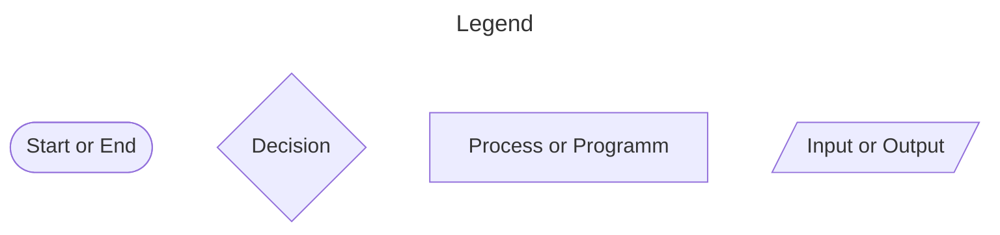
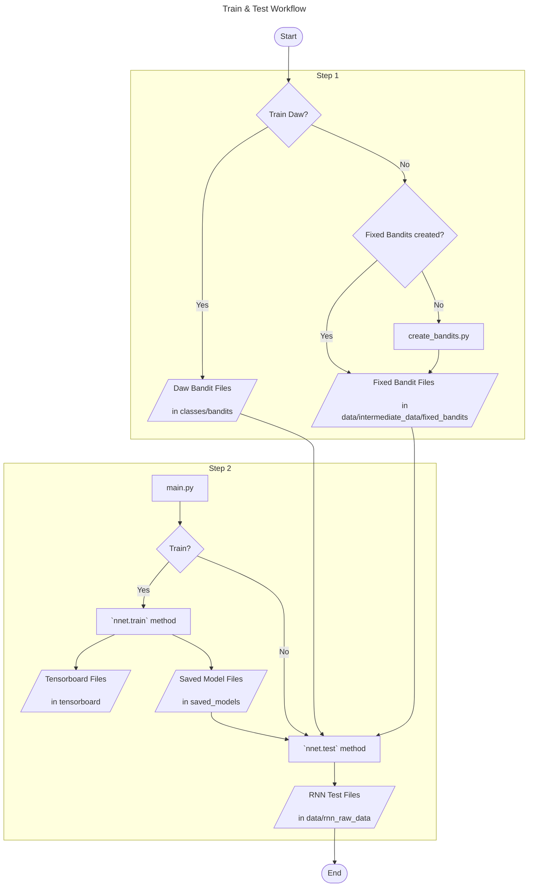
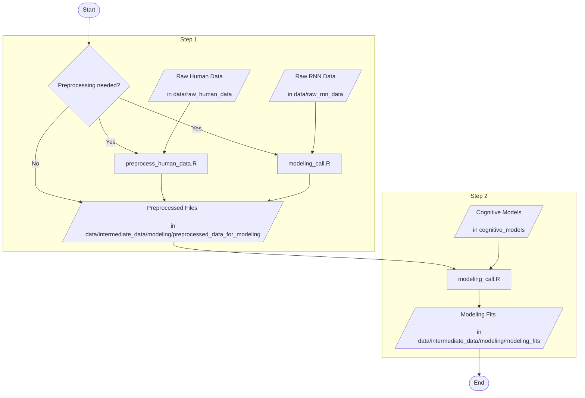

# Training and testing RNNs Workflow

The following guides the user through the workflow of training and testing RNNs in this project. This workflow is based on first making sure that test bandit tasks exist (Step 1) and then test trained RNN agents on them (Step 2). For an high level overview consult the data flow charts below. At the end you can find text explaining the workflow and examples. 

## Flowchart

### Explanations

#### Step 0	
Make sure that the current working directory is the projects root directory

#### Step 1 
* Do you want to test on daw or fixed bandits (e.g., predefined bandits created by you)?
    * If yes: Make sure, that daw bandit files are in classes/bandits (e.g., "Daw2006_payoffs1.csv")
    * If no: Do fixed bandits already exist?
        * If yes: Make sure, that fixed bandit zip files are in data/intermediate_data/fixed_bandits 
        * If no:  Create fixed bandits with scripts/create_bandits.py
             *  Run scripts/create_bandits.py in your IDE (e.g., Spyder) with global variables set accordingly
             *  This will save bandit tasks as zip files to data/intermediate_data/fixed_bandits
 
#### Step 2 
* Open `main.py` and set the global variables accordingly
* Save the script and run `main.py` (In Spyder: You have to run the file via the green run button, running selected code via F9 does not work with multiprocessing)
    *   `main.py` calls first the `nnet.train` and then the `nnet.test` method  
         * `nnet.train` saves training progress to the tensorboard and saved_models folder
         * `nnet.test` loads the trained RNN and the test bandit (task either daw or fixed bandits), resulting test files are saved to data/rnn_raw_data
       
## Example

### Creating fixed bandits

Running scripts/create_bandits.py with the following bandit settings...

will save following zip files to 'data/intermediate_data/fixed_bandits/'.

### Train an test RNN agents

Open `main.py` and set the following in the global variables section to train 4 RNNs (IDS) with 3 levels of hidden units (N_HIDDEN) and 3 levels of entropy scaling (ENTROPIES).

To test the RNN on fixed bandits created above, specify the following, to makes sure, that we load our fixed bandits after training (daw_walks will be ignored).

Define the training bandit (beware that the number of arms have to match with the testing bandit!).

Specify neural network details (Here we train a LSTM with compuation noise for 50000 episodes).

Now save `main.py` and run it in spyder with the run button. This will save training progress to tensorboard and the saved_models folder and resulting test files to data/rnn_raw_data. 

# Cognitive Modeling with human and RNN data

The following guides the user through the workflow of modeling behavioral data in this project. This workflow is based on first preprocessing raw behavioural data if needed (Step 1) and then applying bayesian cognitive modeling via Stan. For an high level overview consult the data flow charts below. At the end you can find text explaining the workflow. 

## Flowchart

### Explanations

#### Step 1	
Is preprocessing needed?
 * If yes: Make sure, that preprocessed files are in data/intermediate_data/modeling/preprocessed_data_for_modeling
 * If no: preprocess files   
    * For human data use `scripts/preprocess_human_data.R`
    * For RNN data use "preprocess test files" section in `modeling_call.R`
    * Files (.RData files) are saved to `path_to_save_formatted_data` (default: 'data/intermediate_data/modeling/preprocessed_data_for_modeling')
          
#### Step 2	
 *  Open `scripts/modeling_call.R` in R Studio
 *  Fit RNN data: Run "Fit RNN data" section 
 *  Fit human data: Run "Fit human data" section
 *  Files (.RData files) are saved to `path_to_save_results` (default: 'data/intermediate_data/modeling/modeling_fits’)

    
